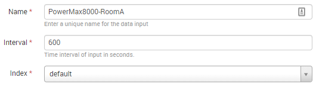
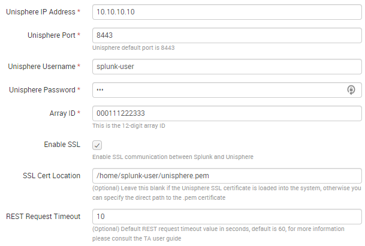
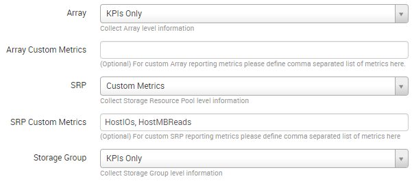

Configuration
=============

Once the PowerMax for Splunk TA and App are installed the next step is to
configure them for use in your environment. Both the TA and App have individual
configuration steps so each will be detailed separately.

Configuring the TA
------------------
From the home dashboard of your Splunk Enterprise UI select the PowerMax for
Splunk Add-On from the app list on the left-side App navigation menu.

The ``Inputs`` view that opens is the list of all VMAX or PowerMax arrays
registered with this instance of Splunk Enterprise.  To add an array to the
Splunk environment click the green button in the top-right corner of the UI
``Create New Input``.

To add an array to Splunk, you must enter a number of details into Splunk
including:

- Unisphere instance & user details
- Array details
- SSL details
- Reporting metrics configuration

The tables below lists each option, its default value if there is one, and a
description of the option. Once all options are set, click ``Add`` to add the
array as a data input to Splunk.

.. note::
    Configuration options are split into multiple tables for readability, they
    all apply to the same process of adding a new array as a data input to
    Splunk.

Splunk Config
~~~~~~~~~~~~~

+-----------+---------------------+-------------------------------------------+
| **Input** | **Default**         | **Description**                           |
+-----------+---------------------+-------------------------------------------+
| Name      | ``None``            | | The name of the input as it will appear |
|           |                     | | in Splunk.                              |
+-----------+---------------------+-------------------------------------------+
| Interval  | ``300``             | | The metrics collection interval. This   |
|           |                     | | should be set in increments of 300s as  |
|           |                     | | this is the reporting interval of       |
|           |                     | | performance metrics in Unisphere.       |
+-----------+---------------------+-------------------------------------------+
| Index     | | ``Default``       | | The index to which data from Unisphere  |
|           | | ``Splunk Index``  | | for this VMAX will be written.          |
+-----------+---------------------+-------------------------------------------+

Unisphere Config
~~~~~~~~~~~~~~~~

+--------------+--------------+-----------------------------------------------+
| **Input**    | **Default**  | **Description**                               |
+--------------+--------------+-----------------------------------------------+
| | Unisphere  | ``None``     | Unisphere IP address or hostname.             |
| | IP Address |              |                                               |
+--------------+--------------+-----------------------------------------------+
| | Unisphere  | ``8443``     | Unisphere port.                               |
| | Port       |              |                                               |
+--------------+--------------+-----------------------------------------------+
| | Unisphere  | ``None``     | Unisphere username.                           |
| | Username   |              |                                               |
+--------------+--------------+-----------------------------------------------+
| | Unisphere  | ``None``     | Unisphere password.                           |
| | Password   |              |                                               |
+--------------+--------------+-----------------------------------------------+
| Array ID     | ``None``     | The 12-digit numerical PowerMax ID.           |
+--------------+--------------+-----------------------------------------------+
| Enable SSL   | ``True``     | | If you require end-to-end SSL communication |
|              |              | | between Splunk and Unisphere. Uncheck to    |
|              |              | | disable SSL entirely. See 'SSL              |
|              |              | | Configuration' section in 'Installation'    |
|              |              | | for more information on SSL set-up.         |
+--------------+--------------+-----------------------------------------------+
| | SSL Cert   | ``None``     | | If ‘Enable SSL’ is enabled, this option has |
| | Location   |              | | two behaviours:                             |
|              |              | | 1. If left blank, Splunk will search the    |
|              |              | | system certs bundle for a valid Unisphere   |
|              |              | | cert.                                       |
|              |              | | 2. If a local path is provided, this is the |
|              |              | | path Splunk will use to access the          |
|              |              | | Unisphere cert independently of the system  |
|              |              | | certs bundle.                               |
+--------------+--------------+-----------------------------------------------+
| | REST       | ``60``       | | The amount of time Splunk will wait for a   |
| | Request    |              | | response from Unisphere for any given call  |
| | Timeout    |              | | before timing out and logging an error.     |
+--------------+--------------+-----------------------------------------------+

Metrics Collection Configuration
~~~~~~~~~~~~~~~~~~~~~~~~~~~~~~~~

.. note::
    For a list of valid metrics for each performance category below please
    see the the :doc:`metrics` section of this documentation.  The metrics
    **must** be in the ``CamelCase`` format used in the Unisphere for PowerMax
    REST API.

.. note::
    If all custom metrics provided for a given category are invalid, the TA
    will default to querying only KPI performance metrics for that category.

.. note::
    The PowerMax for Splunk TA is configured to run entirely from KPI metrics,
    if you do not need any further functionality from the TA and App other than
    to use the App for PowerMax monitoring then you only need to set each
    performance category to collect KPI metrics.

+-----------------+--------------+--------------------------------------------+
| **Input**       | **Default**  | **Description**                            |
+-----------------+--------------+--------------------------------------------+
| Array           | ``Off``      | | Collect all/kpi/custom Array level       |
|                 |              | | metrics or disable entirely.             |
+-----------------+--------------+--------------------------------------------+
| | Array Custom  | ``None``     | | Comma separated list of Array metrics if |
| | Metrics       |              | | custom metrics selected.                 |
+-----------------+--------------+--------------------------------------------+
| SRP             | ``Off``      | | Collect all/kpi/custom SRP level         |
|                 |              | | metrics or disable entirely.             |
+-----------------+--------------+--------------------------------------------+
| | SRP Custom    | ``None``     | | Comma separated list of SRP metrics if   |
| | Metrics       |              | | custom metrics selected.                 |
+-----------------+--------------+--------------------------------------------+
| | Storage       | ``Off``      | | Collect all/kpi/custom SG level          |
| | Group (SG)    |              | | metrics or disable entirely.             |
+-----------------+--------------+--------------------------------------------+
| | SG Custom     | ``None``     | | Comma separated list of SG metrics if    |
| | Metrics       |              | | custom metrics selected.                 |
+-----------------+--------------+--------------------------------------------+
| Director        | ``Off``      | | Collect all/kpi/custom Director level    |
|                 |              | | metrics or disable entirely.             |
+-----------------+--------------+--------------------------------------------+
| | FE Director   | ``None``     | | Comma separated list of FE Director      |
| | Metrics       |              | | metrics if custom Director metrics       |
|                 |              | | selected.                                |
+-----------------+--------------+--------------------------------------------+
| | BE Director   | ``None``     | | Comma separated list of BE Director      |
| | Metrics       |              | | metrics if custom Director metrics       |
|                 |              | | selected.                                |
+-----------------+--------------+--------------------------------------------+
| | RDF Director  | ``None``     | | Comma separated list of RDF Director     |
| | Metrics       |              | | metrics if custom Director metrics       |
|                 |              | | selected.                                |
+-----------------+--------------+--------------------------------------------+
| | IM Director   | ``None``     | | Comma separated list of IM Director      |
| | Metrics       |              | | metrics if custom Director metrics       |
|                 |              | | selected.                                |
+-----------------+--------------+--------------------------------------------+
| | EDS Director  | ``None``     | | Comma separated list of EDS Director     |
| | Metrics       |              | | metrics if custom Director metrics       |
|                 |              | | selected.                                |
+-----------------+--------------+--------------------------------------------+
| Port            | ``Off``      | | Collect all/kpi/custom Port level        |
|                 |              | | metrics or disable entirely.             |
+-----------------+--------------+--------------------------------------------+
| | FE Port       | ``None``     | | Comma separated list of FE Port metrics  |
| | Metrics       |              | | if custom Port metrics selected.         |
+-----------------+--------------+--------------------------------------------+
| | BE Port       | ``None``     | | Comma separated list of BE Port metrics  |
| | Metrics       |              | | if custom Port metrics selected.         |
+-----------------+--------------+--------------------------------------------+
| | RDF Port      | ``None``     | | Comma separated list of RDF Port metrics |
| | Metrics       |              | | if custom Port metrics selected.         |
+-----------------+--------------+--------------------------------------------+
| | Port Group    | ``Off``      | | Collect all/kpi/custom PG level metrics  |
| | (PG)          |              | | or disable entirely.                     |
+-----------------+--------------+--------------------------------------------+
| | PG Custom     | ``None``     | | Comma separated list of PG metrics if    |
| | Metrics       |              | | custom metrics selected.                 |
+-----------------+--------------+--------------------------------------------+
| iSCSI           | ``Off``      | | Collect all/kpi/custom iSCSI level       |
|                 |              | | metrics or disable entirely.             |
+-----------------+--------------+--------------------------------------------+
| | IP Interface  | ``None``     | | Comma separated list of IP Interface     |
| | Metrics       |              | | metrics if custom iSCSI metrics          |
|                 |              | | selected.                                |
+-----------------+--------------+--------------------------------------------+
| | iSCSI Target  | ``None``     | | Comma separated list of iSCSI Target     |
| | Metrics       |              | | metrics if custom iSCSI metrics          |
|                 |              | | selected.                                |
+-----------------+--------------+--------------------------------------------+
| Host            | ``Off``      | | Collect all/kpi/custom Host level        |
|                 |              | | metrics or disable entirely.             |
+-----------------+--------------+--------------------------------------------+
| | Host Custom   | ``None``     | | Comma separated list of Host metrics if  |
| | Metrics       |              | | custom metrics selected.                 |
+-----------------+--------------+--------------------------------------------+
| | Masking       | ``Off``      | | Collect all/kpi/custom MV level metrics  |
| | View (MV)     |              | | or disable entirely.                     |
+-----------------+--------------+--------------------------------------------+
| | MV Custom     | ``None``     | | Comma separated list of MV metrics if    |
| | Metrics       |              | | custom metrics selected.                 |
+-----------------+--------------+--------------------------------------------+
| Initiator       | ``Off``      | | Collect all/kpi/custom Initiator level   |
|                 |              | | metrics or disable entirely.             |
+-----------------+--------------+--------------------------------------------+
| | Initiator     | ``None``     | | Comma separated list of Initiator        |
| | Custom        |              | | metrics if custom metrics selected.      |
| | Metrics       |              |                                            |
+-----------------+--------------+--------------------------------------------+
| RDF Group       | ``Off``      | | Collect all/kpi/custom RDF Group level   |
|                 |              | | metrics or disable entirely.             |
+-----------------+--------------+--------------------------------------------+
| | RDF/S Group   | ``None``     | | Comma separated list of RDF/S Group      |
| | Custom        |              | | metrics if custom RDF metrics selected.  |
| | Metrics       |              |                                            |
+-----------------+--------------+--------------------------------------------+
| | RDF/A Group   | ``None``     | | Comma separated list of RDF/A Group      |
| | Custom        |              | | metrics if custom RDF metrics selected.  |
| | Metrics       |              |                                            |
+-----------------+--------------+--------------------------------------------+
| Metro DR        | ``Off``      | | Collect Metro Disaster Recovery level    |
|                 |              | | information or disable entirely.         |
+-----------------+--------------+--------------------------------------------+
| Snapshot Policy | ``Off``      | | Collect Snapshot Policy level            |
|                 |              | | information or disable entirely.         |
+-----------------+--------------+--------------------------------------------+
| Audit Logs      | ``Off``      | | Collect Audit Log information or disable |
|                 |              | | entirely.                                |
+-----------------+--------------+--------------------------------------------+
| Alerts          | ``Off``      | | Collect Alerts information or disable    |
|                 |              | | entirely.                                |
+-----------------+--------------+--------------------------------------------+

Usage Considerations
--------------------
When using PowerMax for Splunk for performance metrics collection there are a
number of usage considerations that you should keep in mind:

- The PowerMax for Splunk TA is configured to run entirely from KPI metrics,
  if you do not need any further functionality from the TA and App other than
  to use the App for PowerMax monitoring then you only need to set each
  performance category to collect KPI metrics.
- If defining a list of custom metrics for a performance category, the format
  of those metrics should be in ``CamelCase`` exactly as they are in the
  Unisphere for PowerMax official documentation performance section. More
  information available below in the section
  :ref:`Configuration:Performance Metrics Definitions`.
- After enabling Unisphere for performance metrics collection allow Unisphere
  30 minutes to gather enough data before adding the array to Splunk as a data
  input.
- The most granular time available with Unisphere diagnostic performance
  metrics collection is 300 seconds, reporting intervals cannot be set lower
  than 300 seconds.
- If you are collecting metrics from multiple arrays it may take longer than
  300 seconds to complete an entire collection run. If this does happen
  you will see warning messages in your TA logs along with a recommendation
  on what interval should be set.
- If the Unisphere last available performance timestamp is not recent as of
  5-10 minutes ago there is a strong likelihood that your instance of Unisphere
  has gone into catch-up mode and is processing a backlog of performance data.
  It will resume normal operations once this backlog processing is complete.
- When querying a single instance of Unisphere for performance metrics across
  a multiple arrays be careful on the load placed on Unisphere, more arrays
  equates to more Unisphere REST API calls.

Lastly, and most importantly, *with great power comes great responsibility*.
PowerMax for Splunk provides you with the ability to query every performance
metric for a wide range of performance categories. It is important to
remember that the more assets you have created on an array, the more REST calls
that are required to collect information on all of those assets. Multiply that
by the interval set and it can quickly result in a very large volume of calls
to Unisphere.

Instead of gathering everything possible, be resourceful with your calls and
only query what is needed. This will ensure PowerMax for Splunk is performant
and helps reduce network load and the Unisphere for PowerMax user experience is
not negatively affected by excessive REST API calls. If you are only interested
in querying for KPIs, you can specify that only KPI metrics are returned,
but better still only query for a subset of metrics that you are interested in
if you do not require the full suite of dashboards available in the PowerMax
for Splunk App.

Where to find logs
------------------
If you are having issues with the TA or want to check on the performance of
metric collection runs you will need to look at the TA specific log file.
The default location for this log file is:

- ``{splunk_install_dir}/var/log/splunk/ta_dellemc_vmax_inputs.log``

The second important log is the ``splunkd`` log file. If there is issues
initialising the TA and nothing is appearing in the TA log, the ``splunkd``
logs may provide some answers. When Splunk is starting up there should be
warning or error messages for the TA indicating why there is initialisation
issues. The default location for this log file is:

- ``{splunk_install_dir}/var/log/splunk/splunkd.log``

Configuring the App
-------------------
After configuring the PowerMax for Splunk TA with your data inputs, if you have
selected a target index for the inputs other than the default index used by
Splunk you will need to reconfigure the PowerMax for Splunk App search macros.

.. note::
    Search macros are reusable blocks of Search Processing Language (SPL) that
    you can insert into other searches. They are used when you want to use the
    same search logic on different parts or values in the data set dynamically.

For each of the performance and reporting categories supported by PowerMax for
Splunk TA and App there is an associated search macro that points to a
particular index to retrieve PowerMax data.

Navigate to the installation directory of the PowerMax for Splunk App which
contains all default configuration files. Copy the ``macros.conf`` file from
the App ``default`` config directory to the App ``local`` config directory:

.. code-block:: bash

    $ cd {splunk_dir}/etc/apps/Dell-EMC-app-VMAX
    $ cp default/macros.conf local/macros.conf

Edit the newly copied version of ``macros.conf`` in the ``local`` directory
so that each ``index=`` key/value pair represents the indexes in use in your
environment. Each reporting level ingested by the PowerMax for Splunk TA
corresponds to a macro in ``macros.conf`` so all will need updated.

Example:

.. code-block:: bash

    [powermax_array]
    definition = index=main sourcetype=dellemc:vmax:rest reporting_level="Array"
    iseval=0

    [powermax_srp]
    definition = index=main sourcetype=dellemc:vmax:rest reporting_level="SRP"
    iseval=0

Becomes..

.. code-block:: bash

    [powermax_array]
    definition = index=powermax sourcetype=dellemc:vmax:rest reporting_level="Array"
    iseval=0

    [powermax_srp]
    definition = index=powermax sourcetype=dellemc:vmax:rest reporting_level="SRP"
    iseval=0

Once all the macros have been updated to reflect the indexes in use, save the
file and return to Splunk UI. It is advisable here to restart your Splunk
Enterprise server here so changes made here are applied.

Splunk Source Type
------------------
The PowerMax for Splunk TA provides the index-time and search-time knowledge
for inventory, performance metrics, summary, alert and audit log information.
By default, all array data is indexed into the default Splunk index, this is
the ``main`` index unless changed by the splunk admin.

The source type used for the PowerMax for Splunk TA is
``dellemc:vmax:rest``. All events are in ``snake_case`` key/value pair formats.
All events have an assigned ``reporting_level`` which indicates the level at
which the event details, along with the associated ``array_id`` & if reporting
at lower levels, the object ID e.g. ``storage_group_id``, ``director_id``,
``host_id``.

.. note::
    ``vmax`` is still used in ``dellemc:vmax:rest`` instead of ``powermax``
    so reporting on historical data ingested into earlier releases of VMAX for
    Splunk is not broken. This may change in a future release but for now it
    is staying the same.

The TA collects many different kinds of events for VMAX/PowerMax. Depending on
the activity of the Hosts & Initiators in your environment, there may be events
where there are no performance metrics collected. This can be confirmed if
there is a metric present in the event named ``{reporting_level}_perf_details``
with a value of ``False`` (where ``reporting_level`` is the reporting level of
the event itself). For more information see the section
:ref:`Configuration:Active vs. Inactive Objects`.

Active vs. Inactive Objects
---------------------------
To limit the amount of data collected and stored on an array, only active
Hosts and Initiators are reported against for performance metrics.
Inactivity is determined by no activity being recorded by performance monitors
for a specified amount of time.

This is not enforced by Splunk but is the behaviour of the VMAX/PowerMax,
recording zero values for every Host and Initiator in an environment could
potentially very quickly fill databases with useless data.

When the TA is collecting information on the Hosts or Initiators in your
environment, it will first obtain a list of all objects and performance key
timestamps for each. Using these lists, REST calls will be made to Unisphere
for performance metrics for each where a performance key timestamp exists, if
an object is inactive no performance call will be made and no metrics returned.
This new approach which differs from older releases cuts down on the amount of
calls required, it is not necessary to query for performance data if we know in
advance that a host or initiator is inactive.

If a host or initiator is inactive you will see the following key/value pairs
in the event data:

Format:

.. code-block:: bash

    {reporting_level}_perf_details: false
    {reporting_level}_perf_message: No active {reporting_level} performance data available

Example:

.. code-block:: bash

    host_perf_details: false
    host_perf_message: No active Host performance data available

Performance Metrics Definitions
-------------------------------
The PowerMax for Splunk TA ingests a wide range of metrics across each of the
reporting levels. To get detailed definitions of each please consult the
official Unisphere for PowerMax documentation available through the Unisphere
UI in ``Help Options > Online Help``.

When in the official documentation performance metrics can be found in the
section ``Performance Management > Performance Management Metrics.`` From there
you can select the performance category you want to see available metrics for.

Unfortunately this list does not provide users with the format required for
each of these performance categories when querying for data via REST. To assist
with this process there is a list of REST API valid metrics available in the
section :doc:`metrics`.

To get further information on the Unisphere for PowerMax REST API you can now
visit the `Dell API Marketplace`_.

.. URL LINKS

.. _`Dell API Marketplace`: https://api-marketplace.dell.com/
