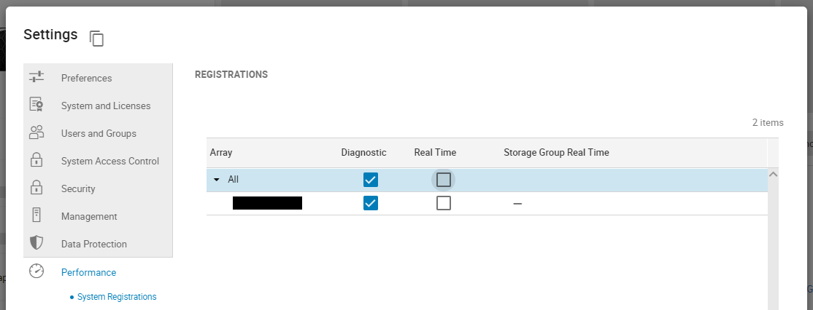
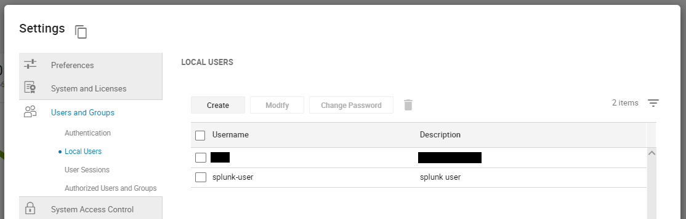
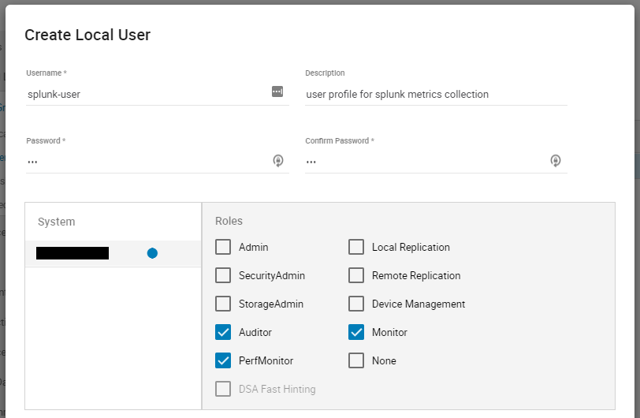
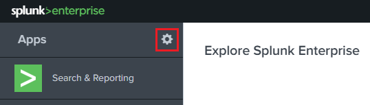

Installation
============

Supported Versions
------------------
+---------------------------------+----------------------------------------+
| **PowerMax for Splunk**         | 3.0                                    |
+---------------------------------+----------------------------------------+
| **Technology Add-On**           | 3.0.0.0                                |
+---------------------------------+----------------------------------------+
| **App**                         | 3.0.0.0                                |
+---------------------------------+----------------------------------------+
| **Minimum Unisphere Version**   | 9.2.0.0                                |
+---------------------------------+----------------------------------------+
| **Array Model**                 | VMAX-3, VMAX AFA, PowerMax             |
+---------------------------------+----------------------------------------+
| **Array uCode**                 | HyperMax OS, PowerMax OS               |
+---------------------------------+----------------------------------------+
| **Minimum Splunk Version**      | Splunk Enterprise 8.1                  |
+---------------------------------+----------------------------------------+
| **Platforms**                   | Linux, Windows                         |
+---------------------------------+----------------------------------------+
| **Python**                      | Splunk Native 3.7                      |
+---------------------------------+----------------------------------------+

.. note::
    To get full support of all features in PowerMax for Splunk 3.x you will
    need to have your array u-code at level 5978.7xx.xxx (Hickory SR) or newer
    and use both Solutions Enabler 9.2.1 and Unisphere for PowerMax 9.2.1.
    PowerMax for Splunk uses new efficiency statistics which are only available
    in the Hickory SR release. If your array is lower than 5978.7xx.xxx then
    these statistics will not be reported on in PowerMax for Splunk.

.. note::
    PowerMax for Splunk has been tested and verified only against Python 3.x.
    There is **no** support for Python 2.x, it reached end-of-life in
    January 2020.

Enable Unisphere Performance Metric Collection
----------------------------------------------
To enable Splunk to gather performance data on the array(s) in your
environment it is necessary to first enable performance metrics for the given
array(s) by registering the system to collect performance data. To register
your array(s) follow these steps:

1. Log in to Unisphere and navigate to ``Settings > Performance > System
Registrations``.

2. Beside ``All`` click the arrow to reveal the local arrays to that instance of
Unisphere.

3. For each array that you want to register for performance metrics check the
box under ``Diagnostic``.

5. Click ``Apply`` to apply the changes.

4. With the registration process complete after 30 minutes Unisphere will
start recording performance metrics which can be ingested into Splunk.

For more information on Unisphere for PowerMax performance registrations please
consult the official guide via the Unisphere UI in ``Help Options >
Online Help``.

Setup Unisphere User Account
----------------------------
It is highly recommended that before using PowerMax for Splunk to capture
data a Splunk specific user profile is created in Unisphere with the required
read-only roles.

1. Navigate to ``Settings > Users and Groups > Local Users``, click ``Create``
to create a new user.

2. Set the ``Username`` and ``Password`` as standard, select the array you want
to collect data for in Splunk under the ``System`` heading.

3. Set the following roles only; ``Auditor``, ``Monitor``, and ``PerfMonitor``.
PowerMax for Splunk does not require any further roles.

4. Click ``OK`` to to create the user. It is now ready for use in Splunk data
input configuration.

SSL Configuration
-----------------
SSL is enabled by default in the TA when adding inputs. In order to
retrieve the required certificate from Unisphere follow the following steps:

1. Get the CA certificate of the Unisphere server. This pulls the CA cert file
and saves it as ``.pem`` file:

.. code-block:: bash

    $ openssl s_client -showcerts -connect {unisphere_host}:8443 \
      </dev/null 2> /dev/null|openssl x509 -outform PEM > unisphere.pem

Where ``{unisphere_host}`` is the hostname or IP address of your Unisphere for
PowerMax server. By default Unisphere uses port ``8443`` so you will need to
change this if not using the default Unisphere port.

.. note::
    Step 2 is optional, if you prefer you can specify the path to the
    certificate when configuring your data inputs in Splunk. If you prefer this
    method please skip to step 3.

2. OPTIONAL STEP: If you want to add the cert to the system certificate bundle
so no certificate path is specified in the PowerMax data input, copy the
.pem file to the system certificate directory as a ``.crt`` file:

.. code-block:: bash

    $ sudo cp unisphere.pem /usr/share/ca-certificates/unisphere.crt

Update CA certificate database with the following commands:

.. code-block:: bash

    $ sudo dpkg-reconfigure ca-certificates
    $ sudo update-ca-certificates

Check that the new ``unisphere.crt`` certificate will activate by selecting
``ask`` in the new dialog window. If it is not enabled for activation, use the
``up`` and ``down`` keys to select, and the ``space`` key to enable or disable.

3. If step 2 is skipped, the cert from step 1 will remain in a local
directory on the Splunk host. You can specify the location of the ``.pem``
cert in the TA data input setting ``SSL Cert Location``. Otherwise, leave
``SSL Cert Location`` blank and ``Enable SSL`` enabled to use the cert from the
system certificate bundle configured in step 2.

Installing the TA and App
-------------------------
The PowerMax for Splunk TA can be installed from the Unisphere UI in two ways:

1. Installed from local copies of the TA and App ``.spl`` files downloaded from
Splunk Base.

or...

2. Installed directly from the Splunk Enterprise UI via ``Find More Apps`` and
searching for ``PowerMax``. The TA and App will appear in the search,
simply click install for the add-on to install it in your Splunk environment.
You will need to restart to complete the installation process.

For the remainder of this section the process of installing from a local file
will be detailed.

1. Download the TA and App from Splunk Base.

- `Dell EMC PowerMax Add-on for Splunk Enterprise`_
- `Dell EMC PowerMax App for Splunk Enterprise`_

2. From your Splunk home screen, click the cog icon beside ``Apps`` to navigate
to the Apps section.

3. Within the Apps section, click the button ``Install App from file`` in the
top right corner of the page.

4. Click ``Choose File``, select the PowerMax Add-on for Splunk, and click
``Upload``.

5. Once the upload is complete you will be prompted to restart Splunk to
complete the installation, click ``Restart now``. When Splunk restarts,
navigate back to the home screen and you will now see a dashboard panel for the
PowerMax for Splunk TA.

6. Repeat steps 2 to 4 to install the PowerMax for Splunk App, you will not be
prompted to restart on this occasion as the App does not require it.

.. note::
    The process for adding arrays to the Splunk environment is detailed in the
    :doc:`configuration` section of this documentation.

.. note::
    There is an additional configuration step required for the App to function
    correctly if using indexes other than the Splunk default index, this is
    detailed in the :doc:`configuration` section of this documentation.

.. URL LINKS

.. _`Dell EMC PowerMax Add-on for Splunk Enterprise`: https://splunkbase.splunk.com/app/3416/
.. _`Dell EMC PowerMax App for Splunk Enterprise`: https://splunkbase.splunk.com/app/3467/
